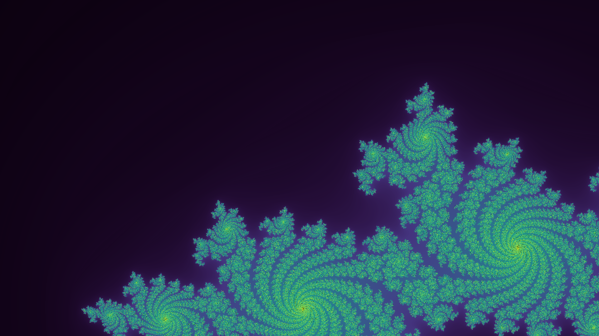
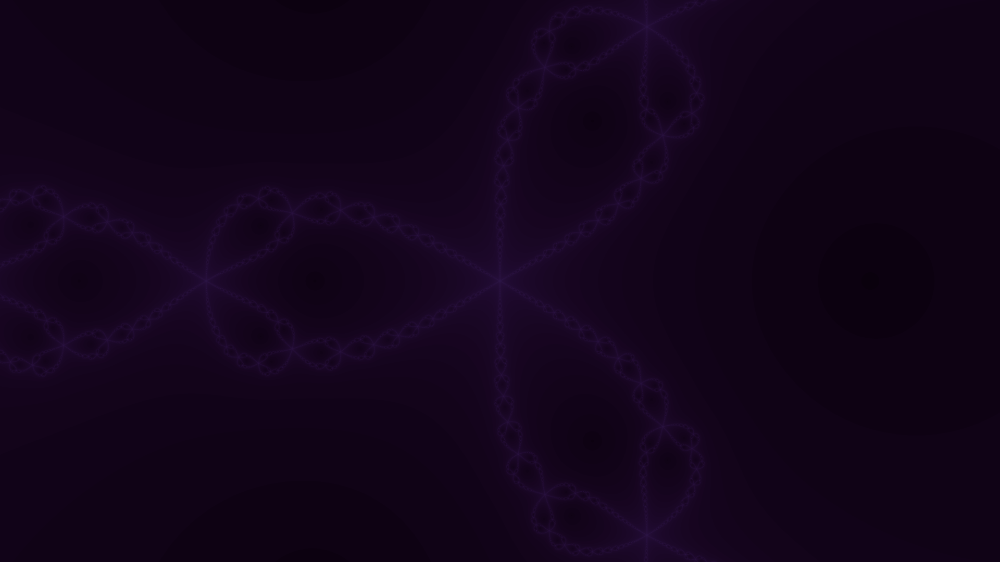

# Fractal Fanatic

<p align="center">
    
    
    
  </p>

A GPU fractal renderer written in Rust, where the per-pixel maths runs as a real
CUDA kernel — compiled straight from Rust to PTX by
[cuda-oxide](https://github.com/NVlabs/cuda-oxide).

I started this as a hobby project to learn two things at once: how fractals are
actually drawn, and how to write GPU code in Rust without dropping down to CUDA C.
It renders the classics (Mandelbrot, Julia) plus a couple that need a bit more
bookkeeping (Phoenix, Newton), and writes the result out as an image.

It's a work in progress and a friendly place to try GPU programming.

## What it can draw

- **Mandelbrot**: the one everyone knows: iterate $z^2 + c$ starting from zero.
- **Julia**: the same rule, but `c` is fixed and the *starting* point varies.
  (This is the default render.)
- **Phoenix**: a second-order recurrence that feeds the *previous* `z` back in,
  giving those flame-like curls.
- **Newton**: Newton's method for $z^3 - 1$, coloured by how quickly each point
  converges to a root.

## How it works

A quick tour, because the GPU part is the interesting bit:

- The `compute` kernel in `src/main.rs` is tagged `#[cuda_module]`. cuda-oxide
  compiles that Rust directly to PTX (peek at the emitted `fractal_fanatic.ptx`
  / `.ll` files if you're curious what it produces).
- Every pixel is one GPU thread. It maps the pixel onto a point in the complex
  plane, iterates the fractal's rule until the point escapes (or converges, or
  hits the iteration cap), and reduces that to a single number.
- That number goes through the viridis colour map and is written out as a binary
  PPM image.
- Each fractal is just a type that implements a small `Fractal` trait
  (`setup` / `step` / `terminated` / `measure`), so adding a new one is mostly
  maths, not plumbing.

## Prerequisites

You'll need:

- An NVIDIA GPU and the CUDA toolkit installed.
- The **cuda-oxide codegen backend** set up — this is the part that turns Rust
  into PTX, and it isn't an ordinary crate. The
  **[cuda-oxide book](https://nvlabs.github.io/cuda-oxide/)** walks through
  installing it.
- A nightly Rust toolchain. You don't have to choose one yourself:
  `rust-toolchain.toml` pins `nightly-2026-04-03` and rustup fetches it for you.

New to GPU programming? The
**[CUDA Programming Guide](https://docs.nvidia.com/cuda/cuda-programming-guide/)**
is the canonical reference for the underlying concepts (threads, blocks, memory)
that cuda-oxide surfaces from Rust.

## Build and run

cuda-oxide ships a `cargo oxide` subcommand that drives its custom codegen
backend (the cuda-oxide book sets this up). To build and render with the defaults
— a 1920x1080 Julia set written to `julia.ppm`:

```bash
cargo oxide run
```

The catch: **`cargo oxide` doesn't forward command-line arguments to the
program**, so `cargo oxide run -- --help` won't do what you'd expect. To pass any
options, run the built executable directly instead. `cargo oxide run` leaves it
in the usual Cargo location, so once you've built at least once:

```bash
# list every option
./target/debug/fractal-fanatic --help

# a 2x-supersampled, deeper-zoomed view written to out.ppm
./target/debug/fractal-fanatic --output out.ppm --half-x 0.5 --ssaa-factor 2
```

The compiled PTX kernel is baked into the binary at build time, so running it
directly needs nothing extra in the environment.

## Command-line options

| Flag                    | Default     | What it does                                                         |
|-------------------------|-------------|----------------------------------------------------------------------|
| `-o, --output <PATH>`   | `julia.ppm` | Output image (binary PPM, P6)                                        |
| `--width <PX>`          | `1920`      | Image width in pixels                                                |
| `--height <PX>`         | `1080`      | Image height in pixels                                               |
| `--center-x <F>`        | `-0.5`      | View centre, real axis                                               |
| `--center-y <F>`        | `-0.5`      | View centre, imaginary axis                                          |
| `--half-x <F>`          | `1.35`      | Half-width of the view in complex-plane units; smaller = deeper zoom |
| `-s, --ssaa-factor <N>` | `1`         | Supersampling per axis (1 = off, 2 = 4x, 3 = 9x)                     |
| `--max-iter <N>`        | `1024`      | Iteration cap before a point counts as "didn't escape"               |

(`--help` and `--version` come for free.)

## Choosing a fractal

There's no CLI flag for this yet — you pick the fractal in `src/main.rs`:

```rust
let fractal = Julia { c: Complex { re: - 0.7, im: 0.27015 } };
```

Swap that line for one of:

```rust
let fractal = Mandelbrot;
let fractal = Phoenix { c: Complex { re: 0.5667, im: 0.0 }, p: Complex { re: - 0.5, im: 0.0 } };
let fractal = Newton { tol: 1e-6 };
```

Different fractals frame best at different viewports — Mandelbrot likes
`--center-x -0.5 --center-y 0 --half-x 1.35`, Newton likes
`--center-x 0 --center-y 0 --half-x 2`.

## Viewing the output

The renderer writes binary PPM (P6), which most image viewers open but GitHub
won't preview inline. To convert to PNG:

```bash
convert julia.ppm julia.png      # ImageMagick
pnmtopng julia.ppm > julia.png   # netpbm
```

## Project layout

| File             | Responsibility                                                                |
|------------------|-------------------------------------------------------------------------------|
| `src/main.rs`    | CLI parsing, the CUDA kernel, host-side orchestration                         |
| `src/fractal.rs` | the `Fractal` trait, the `Orbit` / `Outcome` types, and the four fractals     |
| `src/number.rs`  | a tiny `Float` trait (so the kernel works in f32 or f64) and a `Complex` type |
| `src/render.rs`  | per-pixel rendering, including supersampling                                  |
| `src/view.rs`    | maps the image viewport onto the complex plane                                |
| `src/color.rs`   | the viridis palette                                                           |
| `src/image.rs`   | the binary PPM writer                                                         |

## Licence

BSD 3-Clause — see [LICENCE](LICENCE).
